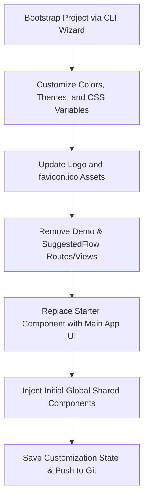

# Initial Setup & Branding Customization Flow

This skill file defines the exact steps required to customize, brand, and clean up the monorepo template. By feeding this file to your AI coding agent, the agent can automatically execute these initial setup tasks, saving time and maintaining structural consistency.

---

## 🛠️ Conceptual Workflow

When initializing a new application from this monorepo template, the customization process follows this flow:

---

## 📂 Core Files Impacted

* **Styles & Themes**: `frontend/src/styles.css` & `frontend/src/app/core/services/theme.service.ts`
* **Layout & Routing**: `frontend/src/app/app.html` & `frontend/src/app/app.routes.ts`
* **Assets**: `frontend/public/logo.png` & `frontend/public/favicon.ico`
* **Feature Views**: `frontend/src/app/features/starter/` (to modify) and `demo/` / `suggested-flow/` (to delete)

---

## 📋 Step-by-Step Customization Guide for AI Agents

When instructed to perform the initial flow setup, the AI agent should execute the following operations:

### 1. Brand Customization & Theming
* Locate the CSS custom properties in `frontend/src/styles.css` inside the `:root` and selector overrides (e.g. `[data-theme="dark"]`, `[data-theme="oled"]`, etc.).
* Update theme color HSL values to match the target brand identity.
* If creating a new custom theme, follow the guidelines in `skills/CUSTOM-THEMES.md` to define the variables in `styles.css` and register the theme in `theme.service.ts`.

### 2. Update Brand Assets
* Replace `frontend/public/logo.png` with the target brand logo (standard size: ~145x30px).
* Replace `frontend/public/favicon.ico` with the target favicon.
* Verify that the main layout header in `frontend/src/app/app.html` references the correct path for `logo.png`.

### 3. Remove Demo & SuggestedFlow Configurations
To clean the template structure:
* **Remove Router Links**: Edit `frontend/src/app/app.html` and delete the sidebar router link blocks for `/demo` and `/suggested-flow`.
* **Clean Routing Map**: Edit `frontend/src/app/app.routes.ts` to delete the imports and route configurations for `Demo` and `SuggestedFlow`. Keep the `Starter` route and wildcards.
* **Delete Component Directories**: Delete the following folders from the filesystem to keep the codebase clean:
  * `frontend/src/app/features/demo/`
  * `frontend/src/app/features/suggested-flow/`

### 4. Replace or Customize the Starter Component
* Modify `frontend/src/app/features/starter/starter.html` and `starter.ts` to contain the primary interface of the application.
* Keep the general layout grids and status alert containers if needed for demo testing, or replace them entirely.

### 5. Establish Initial Global Shared Components
* Add any custom global features (such as notifications, custom modals, shared side nav links, and tooltips) that all applications in your portfolio should share.
* Follow the standards in `skills/NEW-UI-COMPONENTS.md` to ensure they are written as `standalone: true` Angular components.

---

## 🚫 Strict Constraints & Anti-Patterns for AI Agents

* **DO NOT** delete `app-theme-selector` component or theme-handling logic unless specifically instructed; they provide essential theme switching capabilities.
* **DO NOT** modify the path-mapping configurations (`@shared/*`) in `tsconfig.json` files.
* **DO NOT** add standard Tailwind dependencies; always style components using the `vb-` classes defined in `styles.css` or component-specific vanilla stylesheets.
